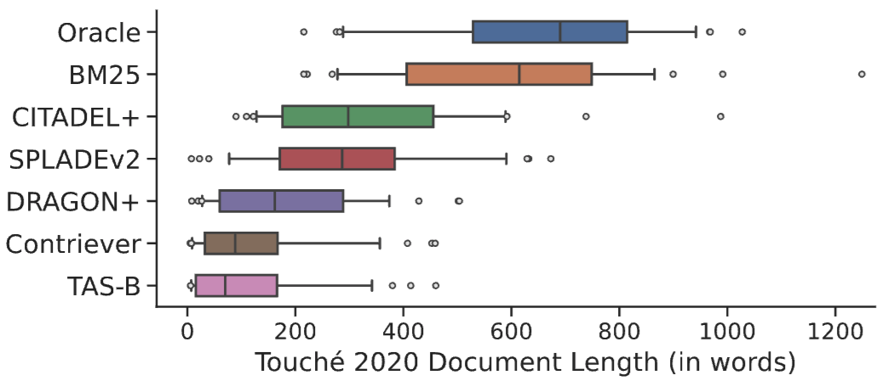

<div align="center">

<h1>Touché 2020 V3</h1>

<i>Systematic Evaluation of Neural Retrieval Models on the Touché 2020 Argument Retrieval Subset of BEIR</i>

<table>
      <tr>
            <td>
                  <a href="https://github.com/castorini/touche-error-analysis">💻 GitHub</a>
            </td>
            <td>
                  <a href="https://huggingface.co/datasets/castorini/webis-touche2020-v3">🤗 Dataset</a>
            </td>
            <td>
                  <a href="https://downloads.webis.de/publications/papers/thakur_2024.pdf">📝 SIGIR 2024 Paper</a>
            </td>
      </tr>
</table>
</div>

Welcome to the reproduction study of the Touché 2020 dataset in the BEIR benchmark, where previous studies have found that neural retrieval models are considerably less effective than BM25.

We further investigate on what makes argument retrieval so “special”, and "why" do neural retrievers underperform BM25 on Touché 2020? 



From the figure above, we observe that a majority of neural retrievers on Touché 2020 retrieve "short" (in length) arguments as their top-10 results which are often non-argumentative. In addition, all retrievers (including BM25) have a huge portion of holes present in the corpus leading to rather low nDCG@10 performances.

**TL;DR:** We denoise the Touché 2020 document collection and remove noisy arguments and conduct post-hoc judgements to release a cleaner Touché 2020 v3 collection. This repository uses code from existing well-known repositories such as [BEIR](https://github.com/beir-cellar/beir), [Pyserini](https://github.com/castorini/pyserini) and [SPRINT](https://github.com/thakur-nandan/sprint) for reproduction and provides baseline retrieval model scores on Touché 2020 v3 dataset.

To learn more about our reproduction study, please refer below to the following publications:
- [Systematic Evaluation of Neural Retrieval Models on the Touché 2020 Argument Retrieval Subset of BEIR](https://arxiv.org/abs/2407.07790) (SIGIR 2024, Reproducibility Track)

## Getting Started

### Installation
You will need to install tookits: Pyserini (BM25), SPRINT toolkit (SPLADEv2) and BEIR (Dense Models). To install the necessary packages, run:

```sh
conda create -n python_env python=3.10
conda activate python_env

# Install JDK 21 via conda
conda install -c conda-forge openjdk=21

# PyPI installations: BEIR, Pyserini, SPRINT
pip install -r requirements.txt
```

### Dataset

The Touche 2020 v3 dataset (denoised + post-hoc judged) can be found here: [castorini/webis-touche2020-v3](https://huggingface.co/datasets/castorini/webis-touche2020-v3).
- `corpus.jsonl` contains 303,372 arguments with argument premise as body (filtering the argument corpus).
- `queries.jsonl` contains 49 controversial queries (all test queries).
- `qrels/test.tsv` contains 2,849 relevance judgements in total (including additional post-hoc relevance judgements).

## Examples

- [evaluate_dense_model.py](examples/evaluate_dense_model.py) contains an example to evaluate any dense retriever (supported by Sentence Transformers) on the Touché 2020 V3 dataset.
- [evaluate_bm25_lexical.sh](examples/evaluate_bm25_lexical.sh) contains an example to evaluate the BM25 lexical retriever (supported by Pyserini) on the Touché 2020 V3 dataset.
- [evaluate_sparse_model.sh](examples/evaluate_sparse_model.sh) contains an example to evaluate any sparse retriever (supported by SPRINT toolkit) on the Touché 2020 V3 dataset.
- For CITADEL+ reproduction, we need to install `dpr-scale` and follow steps here: [https://github.com/thakur-nandan/citadel-repro](https://github.com/thakur-nandan/citadel-repro).

## Citation

If you use this code or dataset in your research, please cite our SIGIR 2024 paper.

```python
@INPROCEEDINGS{Thakur_etal_SIGIR2024,
   author = "Nandan Thakur and Luiz Bonifacio and Maik {Fr\"{o}be} and Alexander Bondarenko and Ehsan Kamalloo and Martin Potthast and Matthias Hagen and Jimmy Lin",
   title = "Systematic Evaluation of Neural Retrieval Models on the {Touch\'{e}} 2020 Argument Retrieval Subset of {BEIR}",
   booktitle = "Proceedings of the 47th International ACM SIGIR Conference on Research and Development in Information Retrieval",
   year = 2024,
   address_ = "Washington, D.C."
}
```

## License

This project is licensed under the Apache 2.0 License - see the [LICENSE](LICENSE) file for details.

## Authors

- Nandan Thakur (University of Waterloo, Waterloo, Canada)
- Luiz Bonifacio (UNICAMP and University of Waterloo, Campinas, Brazil)
- Maik Fröbe (Friedrich-Schiller-Universität Jena, Jena, Germany)
- Alexander Bondarenko (Leipzig University and Friedrich-Schiller-Universität Jena, Leipzig, Germany)
- Ehsan Kamalloo (University of Waterloo, Waterloo, Canada)
- Martin Potthast (University of Kassel, hessian.AI, and ScaDS.AI, Kassel, Germany)
- Matthias Hagen (Friedrich-Schiller-Universität Jena, Jena, Germany)
- Jimmy Lin (University of Waterloo, Waterloo, Canada)

## Acknowledgments

We would like to thank all contributors and the institutions involved in this research. Special thanks to the BEIR benchmark and Touché 2020 authors.

```
This repository contains experimental software and is published for the sole purpose of giving additional background details on the respective publication.